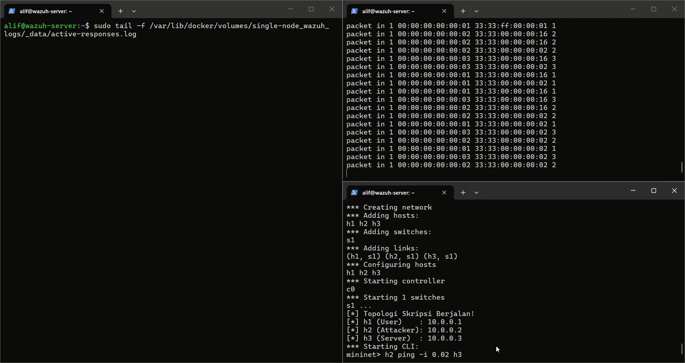
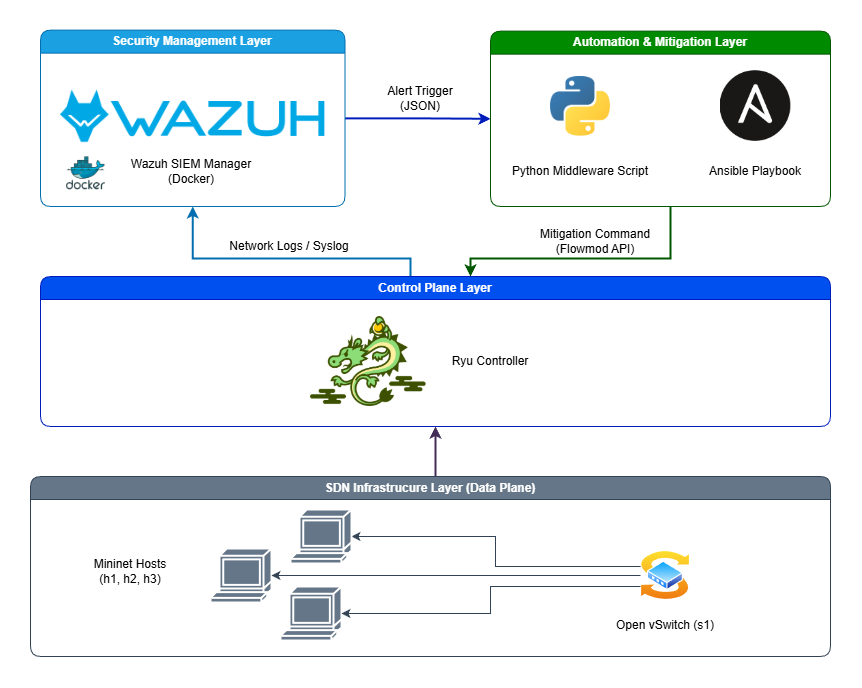
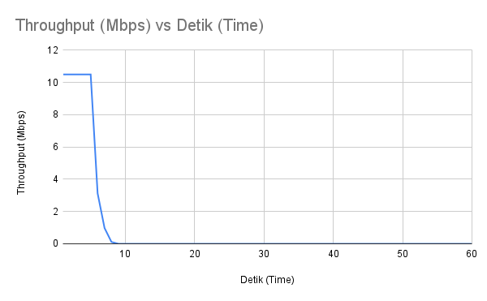

# Automated DDoS Mitigation in SDN using SOAR Concept 🛡️⚡

## 📌 Overview

This repository showcases a Proof-of-Concept (PoC) for a **Security Orchestration, Automation, and Response (SOAR)** architecture. It is designed to automatically detect and mitigate Volumetric DDoS attacks in a Software-Defined Networking (SDN) environment with an impressive average response time of **~8.8 seconds**.

> **Note:** The source code (Python wrappers, Ansible playbooks, and Wazuh custom rules) is currently **PRIVATE**. The repository will be open-sourced upon official publication.

## 🛑 The Problem: Why This Matters

In modern network infrastructure, speed and accuracy are everything.

- **High Financial Impact:** Every minute of downtime costs organizations thousands of dollars.
- **Slow Manual Response:** Traditional mitigation requires admins to manually analyze logs and write rules, a process that typically bleeds 15 to 30 critical minutes.
- **The "False Positive" Dilemma:** Aggressive automated systems often "panic" during sudden, legitimate traffic spikes (flash crowds), accidentally blocking real users or critical internal servers.

## 💡 The Solution: Tiered Mitigation & Safelist

To bridge the gap between human latency and robotic inaccuracy, this system builds an automated bridge between **Wazuh (SIEM)** and **Ansible** via the **Ryu Controller**.

Instead of a blind immediate block, it employs a **Smart Tiered Mitigation** strategy:

- ✅ **Stage 1 (The Quarantine):** Upon initial detection, the suspect's traffic is throttled to 1 Mbps. This prevents server overload while verifying if the spike is malicious or legitimate.
- ✅ **Stage 2 (The Permanent Drop):** If high-volume traffic persists, a permanent Drop flow is injected directly into the SDN Data Plane, cutting off the attacker at the network edge.
- ✅ **Safelist & Anti-Spam Middleware:** A custom Python gateway enforces a **Cooldown mechanism** to prevent execution loops and utilizes a **Safelist** to ensure core network nodes remain untouchable.

## 🏗️ System Workflow

1. **Monitor:** Open vSwitch forwards network telemetry to the Ryu Controller.
2. **Detect:** Ryu forwards logs to Wazuh. Wazuh correlates logs against custom threshold rules (`Rule ID: 100011` & `100012`).
3. **Orchestrate:** Wazuh acts as the "brain," triggering a Python wrapper via its **Active Response** module.
4. **Respond:** Once validated against Safelist/Cooldown, the script executes Ansible playbooks over SSH.
5. **Mitigate:** Ansible communicates with the Ryu REST API, pushing OpenFlow rules (Meter/Drop) directly to the switch.

## 📊 Performance & Results

Tested using `hping3` and `iperf` in a simulated Mininet environment.

**Key Metrics (10 Iteration Average):**

- **MTTR (Mean Time To Respond):** **~8.8 Seconds** (Total mitigation).
- **Throughput Drop:** Seamless reduction from ~10.5 Mbps to **0.00 Mbps**.
- **Resource Efficiency:** Stable CPU utilization due to the rule-based approach.

### Mitigation Test Logs

|  Test   | Normal Bandwidth | Stage 1: QoS Limit | Stage 2: Permanent Block | Total Mitigation Time |   Final Status   |
| :-----: | :--------------: | :----------------: | :----------------------: | :-------------------: | :--------------: |
|    1    |    10.6 Mbps     |     7th Second     |       10th Second        |      10 Seconds       |   Stable Drop    |
|    2    |    10.6 Mbps     |     6th Second     |        8th Second        |       8 Seconds       |   Stable Drop    |
|    3    |    10.6 Mbps     |     7th Second     |        9th Second        |       9 Seconds       |   Stable Drop    |
|    4    |    10.6 Mbps     |     7th Second     |        9th Second        |       9 Seconds       |   Stable Drop    |
|    5    |    10.5 Mbps     |     6th Second     |        9th Second        |       9 Seconds       |   Stable Drop    |
|    6    |    10.6 Mbps     |     4th Second     |        6th Second        |       6 Seconds       |   Stable Drop    |
|    7    |    10.6 Mbps     |     5th Second     |        8th Second        |       8 Seconds       |   Stable Drop    |
|    8    |    10.5 Mbps     |     7th Second     |       10th Second        |      10 Seconds       |   Stable Drop    |
|    9    |    10.5 Mbps     |     7th Second     |       10th Second        |      10 Seconds       |   Stable Drop    |
|   10    |    10.5 Mbps     |     6th Second     |        9th Second        |       9 Seconds       |   Stable Drop    |
| **AVG** |  **~10.5 Mbps**  |  **~6.2 Seconds**  |     **~8.8 Seconds**     |   **~8.8 Seconds**    | **100% SUCCESS** |

## 🤝 Let's Connect

I am deeply passionate about the intersection of Network Security, SDN, and Automation.

Whether you are looking for a driven intern, want to discuss technical architectures, or wish to request a private code review project, I'd love to connect:

- **LinkedIn:** [Muhammad Alif Febriansyah](https://www.linkedin.com/in/muhammadaliffebriansyah/)
- **Email:** aliffebriansyah1074@gmail.com

---

_© 2026 Alif. All Rights Reserved._
